# Introduction
This is the guideline on how to add a new package into Engage.

# Installation steps

**1.** Clone the package sample which is located in **packages\sample** of installation folder into folder **packages**
<br />
**2.** Rename the package directory (for example **packages\abc**), service provider file ... (following structure below)
<br />
## Package Structure
```
.
|__src
|  |__config
|  |  |__package-layout.php
|  |__Console
|  |__Http
|  |__Models
|  |__...
|  |__SampleServiceProvider.php
|  |__Utility.php
|__composer.json
```

**3.** Update package's **composer.json**: package name, class namespace, and service provider ... 
<br />
**4.** Update view alias in the service provider file. It must be the same as package name and with the dash **"/"** replaced by an underscore **"_"**. Make sure that the names of your views match the alias. 
<br />
**5.** Update **package-layout.php**: Update the top key (id) to be as same as the package name and with the dash **"/"** be replaced by an underscore **"_"**.
<br />
**6** Update **Utility.php**: Update the namespace so that it points to your package.
<br />
**7.** Update Controllers: Ensure that the namespace contains your package directory for your controllers. Furthermore, ensure that the **sampleNavigationPage()** function returns your view within the correct view alias.
<pre>
 public function sampleNavigationPage() {
        return view('engage_abc::sample-navigation-page');
    }
}

</pre>

**8.** Update **web.php:** Ensure that the namespace is pointing to the controllers in your package and configure the routes to get the navigation (id) and extra-profile-navigation. <br />
<br />
Example:

<pre>
function () {
    Route::get('abc-navigation/{id}', [SampleController::class, 'sampleNavigationPage'])->name('abc_navigation')->middleware(['auth', 'XSS']);
    Route::get('abc-extra-profile-navigation', [SampleController::class, 'sampleNavigationPage'])->name('abc_extra_profile_navigation')->middleware(['auth', 'XSS']);
</pre>


**9.** Add following code to the application's **composer.json** located in the root installation folder:
<br />
<pre>
"repositories": [
        { "type": "path", "url": "packages/[package_name]"}
    ]
</pre>

Example:
<pre>
"repositories": [
        { "type": "path", "url": "packages/ird"},
        <b>{ "type": "path", "url": "packages/abc"}</b>
    ]
</pre>

**10.** Run the command

```php
   composer require engage/[package_name]:"*"
   ```
Example:
```php

   composer require engage/abc:"*"

```   
Note: If there are assets files, you must update service provider and use a command to publish them.

For more information, please go to [Laravel Package Development](https://laravel.com/docs/10.x/packages)


* <p>composer.json, SampleServiceProvider.php, Utility.php, config/package-layout.php are <span style="color: red">required files</span> with naming of <b>package-layout.php,</b> which is <span style="color: red">required not to be changed.</span></p>
* The rest of the directories and files are custom source code.

### **1. composer.json**: Specifications of the package like package name, autoload, provider ...
<br />

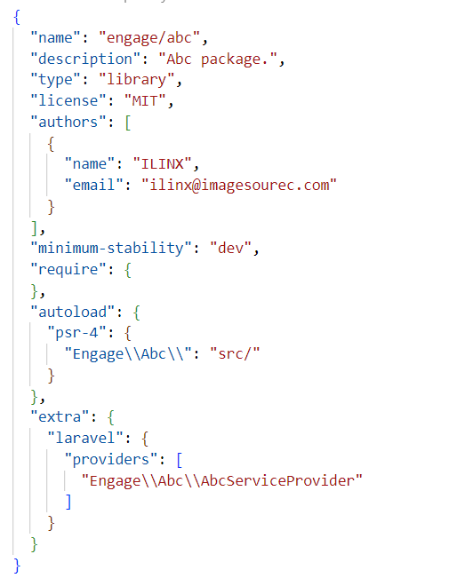
>
><b>Note:</b>
>
>The <b>package class namespace</b> must be defined <b>as same as the name of the package</b> and following the psr-4 rule: <b>capitalize the first letter</b>. For example: package name is <b>engage/abc</b> so the namespace must be <b>"Engage/Abc"</b>.
>
<br />

### **2. SampleServiceProvider.php**: Responsible for binding things into Laravel's service container and informing Laravel where to load package resources such as views, configuration, asset files ...

1. Define the location where the views will be loaded from -  **the alias = package name with the dash "/" be replaced by an underscore "_"**. For example: the package name is **engage/abc** then the view alias will be **engage_abc**.

   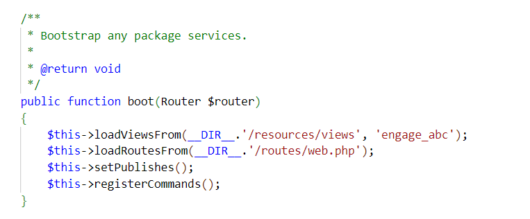

2. Define configuration merging  **package-layout**

   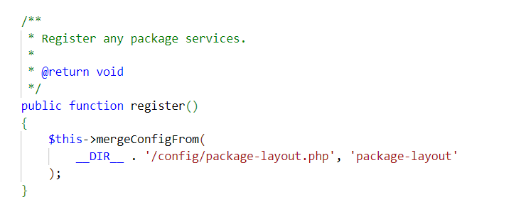

### **3. Utility.php**: contains function to get data source, you can also add more custom functions if needed here.
<br />

  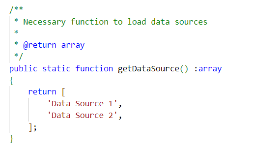

>public static function **getDataSource()** returns the source data which will be used when adding a content card or navigation - method name is required <b>not to be changed.<b>
<br />

### **4. package-layout.php**: configuration to define navigation, card content ...


>The top key (id of the configuration) must be the same as the package name and similar to the view alias defined in **SampleServiceProvider.php** with the dash **"/"** be replaced by an underscrore **"_"**.

  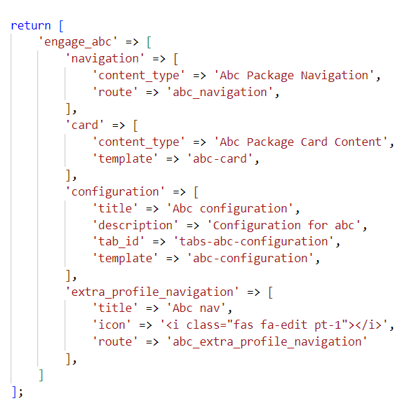

<br />

* **Navigation**: defines the content type when creating the navigation and the route of the navigation.


  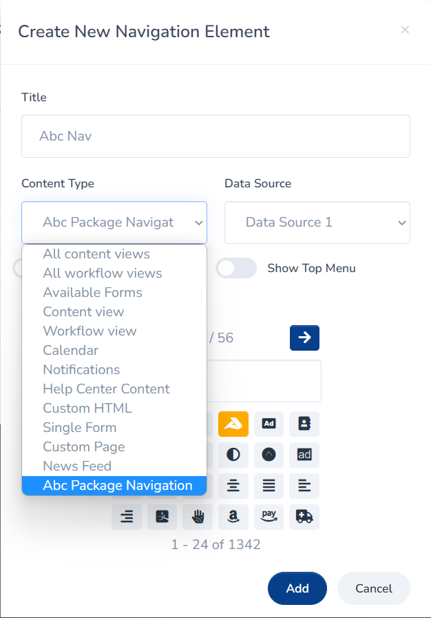

<br />

 >The data sources come from function **getDataSource()**  in **Utility.php**

  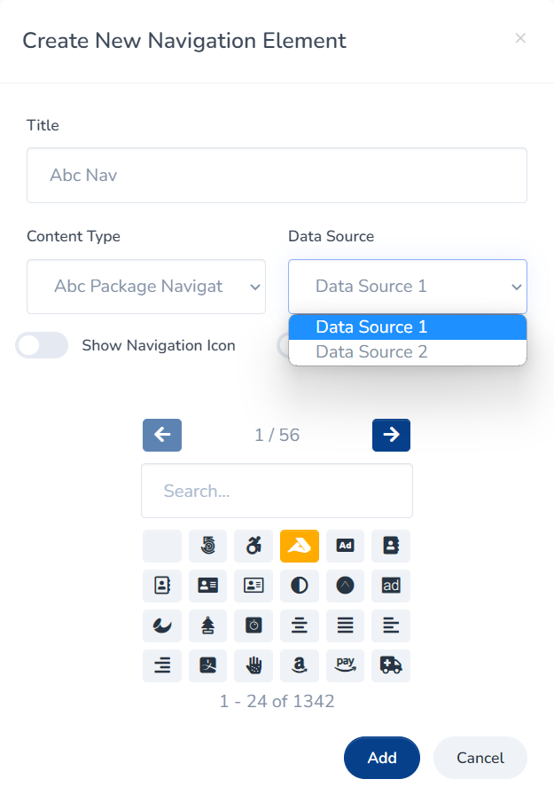

 >The new navigation is created with the route defined in the config file **package-layout.php** and the selected data source.

  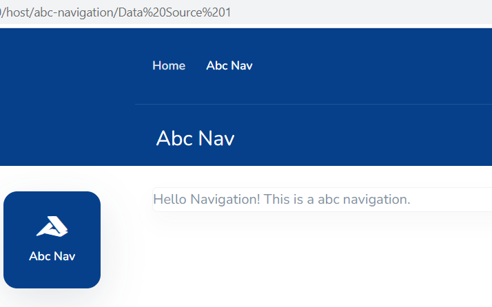

* **Card**: defines the content type when creating the home page card content and the template.


  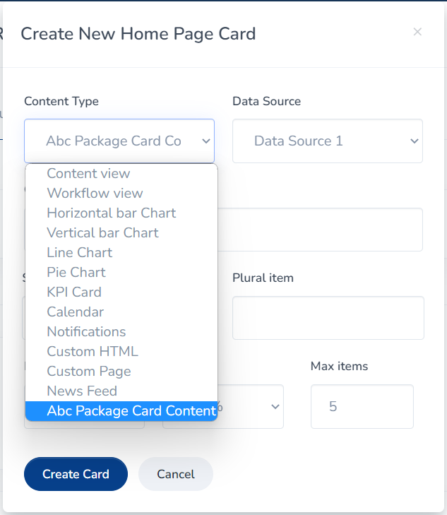

  >The data source also come from function **getDataSource()** in **Utility.php**

  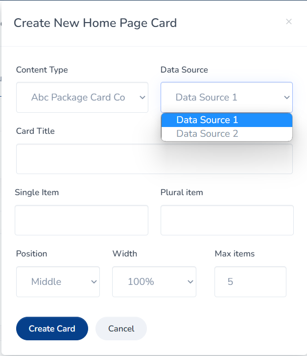

<br />

  > New card content is created in home page with the template defined in the config file **package-layout.php** and the selected data source.

  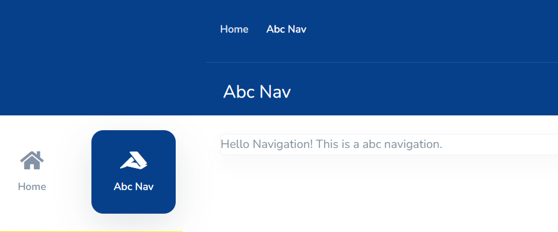

* **Configuration**: defines the package configuration page in settings.


  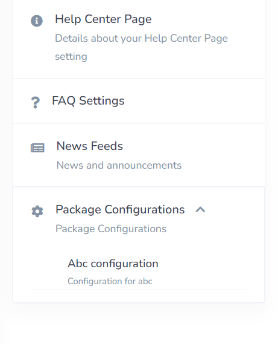

* **extra_profile_navigation**: defines the navigation in profile menu.


  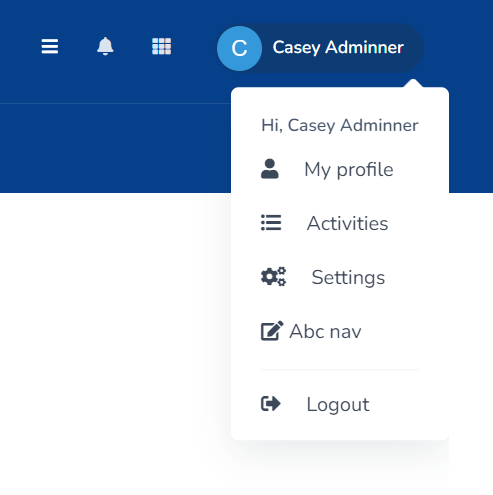

# Uninstallation

Run the command

```
   composer remove engage/[package_name]
   ```

Example:
```
   composer remove engage/abc
   ```
